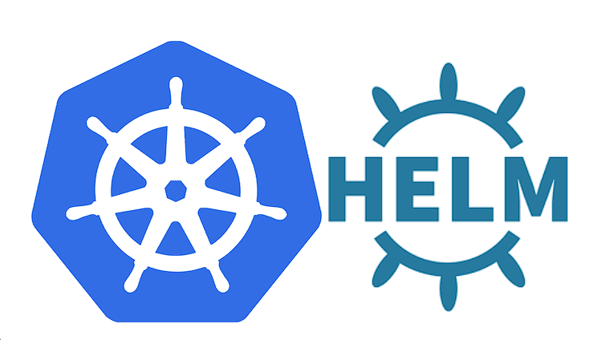

<h1><a name="readme-top"></a></h1>

[](https://github.com/marcossilvestrini/learning-helm/actions/workflows/release-charts.yml)


[![MIT License][license-shield]][license-url]
[![Forks][forks-shield]][forks-url]
[![Stargazers][stars-shield]][stars-url]
[![Contributors][contributors-shield]][contributors-url]
[![Issues][issues-shield]][issues-url]
[![LinkedIn][linkedin-shield]][linkedin-url]

# LEARNING HELM



<p align="center">
<strong>Explore the docs »</strong></a><br />
    <a href="https://github.com/marcossilvestrini/learning-helm/">Main Page</a>
    -
    <a href="https://github.com/marcossilvestrini/learning-helm">Code Page</a>
    -
    <a href="https://github.com/marcossilvestrini/learning-helm/issues">Report Bug</a>
    -
    <a href="https://github.com/marcossilvestrini/learning-helm/issues">Request Feature</a>
</p>

## Summary

<details>
  <summary><b>TABLE OF CONTENT</b></summary>
  <ol>
    <li>
      <a href="#about-the-project">About The Project</a>
    </li>
    <li>
      <a href="#getting-started">Getting Started</a>
      <ul>
        <li><a href="#prerequisites">Prerequisites</a></li>
        <li><a href="#installation">Installation</a></li>
      </ul>
    </li>
    <li><a href="#usage">Usage</a></li>
    <li><a href="#roadmap">Roadmap</a></li>
    <li><a href="#create-cluster">Create Kubernetes Cluster</a></li>
    <li><a href="#install-helm">Install helm</a></li>
    <li><a href="#helm-charts">Helm Charts</a></li>
    <li><a href="#license">License</a></li>
    <li><a href="#contact">Contact</a></li>
    <li><a href="#acknowledgments">Acknowledgments</a></li>
  </ol>
</details><br>

<a name="about-the-project"></a>

## About Project

>This project aims to help students or professionals to learn the main concepts of helm

<p align="right">(<a href="#readme-top">back to top</a>)</p>

<a name="getting-started"></a>

## Getting Started

This is an example of how you may give instructions on setting up your project locally.
To get a local copy up and running follow these simple example steps.

<a name="prerequisites"></a>

### Prerequisites

This is an example of how to list things you need to use the software
and how to install them.

* git
* kubernetes cluster up

<a name="installation"></a>

### Installation

#### Clone repository

```sh
git clone https://github.com/marcossilvestrini/learning-helm.git
```

## Usage

Use this repository for get learning about helm exam

<p align="right">(<a href="#readme-top">back to top</a>)</p>

<a name="roadmap"></a>

## Roadmap

* [x] Create repository
* [x] Create a kubernetes cluster
* [x] Install helm
* [x] Add Examples of helm charts

<p align="right">(<a href="#roadmap">back to roadmap</a>)</p>
<p align="right">(<a href="#readme-top">back to top</a>)</p>

## Create Kubernetes Cluster

<a name="create-cluster"></a>

### Minikube

```sh
# install
curl -Lo minikube https://storage.googleapis.com/minikube/releases/latest/minikube-linux-amd64
chmod +x ./minikube
sudo mv ./minikube /usr/local/bin/minikube

# get version
minikube version

# set hypervisor
minikube config set driver <YOUR_HYPERVISOR>

# up without hypervisor
minikube start --driver=hyperkit

# create cluster
minikube start --nodes 3 -p multinode-cluster

# get status of cluster
minikube status

# get ip address
minikube ip

# access minikube host
minikube ssh

# dashboard
minikube dashboard

# logs
minikube logs

# delete cluster
minikube delete
minikube delete --purge
```

### Kind

```sh
# Install
curl -Lo ./kind https://kind.sigs.k8s.io/dl/v0.14.0/kind-linux-amd64
chmod +x ./kind
sudo mv ./kind /usr/local/bin/kind

# create cluster
kind create cluster
kind create cluster --name silvestrini

# get clusters
kind get clusters

# delete clusters
kind delete clusters $(kind get clusters)

## create yaml
cat << EOF > $HOME/kind-3nodes.yaml
kind: Cluster
apiVersion: kind.x-k8s.io/v1alpha4
nodes:
  - role: control-plane
  - role: worker
  - role: worker
EOF

# create cluster
kind create cluster --name kind-multinodes --config $HOME/kind-3nodes.yaml
```

<p align="right">(<a href="#create-cluster">back to create-cluster</a>)</p>
<p align="right">(<a href="#readme-top">back to top</a>)</p>

## Kubectl

<a name="kubectl"></a>

### Install

```sh
# install
curl -LO https://storage.googleapis.com/helm-release/release/`curl -s \ 
https://storage.googleapis.com/helm-release/release/stable.txt`/bin/linux/amd64/kubectl
chmod +x ./kubectl
mv ./kubectl /usr/local/bin/kubectl

# get version
kubectl version  --output=yaml --client

# kubectl autocomplete
source <(kubectl completion bash)

# kubectl alias
alias k=kubectl
complete -F __start_kubectl k
```

<p align="right">(<a href="#kubectl">back to kubectl</a>)</p>
<p align="right">(<a href="#readme-top">back to top</a>)</p>

## Install Helm

<a name="install-helm"></a>

```sh
curl https://raw.githubusercontent.com/helm/helm/main/scripts/get-helm-3 | bash
helm version
```

<p align="right">(<a href="#install-helm">back to install-helm</a>)</p>
<p align="right">(<a href="#readme-top">back to top</a>)</p>

## Helm Repositories

<a name="helm-repo"></a>

```sh
# list available repositories
helm repo list

# add repositories
helm repo add bitnami https://charts.bitnami.com/bitnami

# update repositories
helm repo update

# remove repositories
helm repo remove bitnami  
```

<p align="right">(<a href="#helm-repo">back to helm-repo</a>)</p>
<p align="right">(<a href="#readme-top">back to top</a>)</p>

## Helm Packages

<a name="helm-packages"></a>

```sh
# list available packages
helm list
helm list -n silvestrini
helm list -A

# install package
helm install silvestrini-phpmyadmin bitnami/phpmyadmin
helm upgrade --install silvestrini-phpmyadmin bitnami/phpmyadmin

# install package in specified namespace
helm install --namespace silvestrini silvestrini-phpmyadmin bitnami/phpmyadmin

# upgrade packages
helm upgrade silvestrini-phpmyadmin bitnami/phpmyadmin

# uninstall package
helm uninstall silvestrini-phpmyadmin
```

<p align="right">(<a href="#helm-packages">back to helm-packages</a>)</p>
<p align="right">(<a href="#readme-top">back to top</a>)</p>

## Helm Charts

<a name="helm-charts"></a>

### Chart structure

```yaml
wordpress/
  Chart.yaml          # A YAML file containing information about the chart
  LICENSE             # OPTIONAL: A plain text file containing the license for the chart
  README.md           # OPTIONAL: A human-readable README file
  values.yaml         # The default configuration values for this chart
  values.schema.json  # OPTIONAL: A JSON Schema for imposing a structure on the values.yaml file
  charts/             # A directory containing any charts upon which this chart depends.
  crds/               # Custom Resource Definitions
  templates/          # A directory of templates that, when combined with values,
                      # will generate valid Kubernetes manifest files.
  templates/NOTES.txt # OPTIONAL: A plain text file containing short usage notes
  ```

### Helm Chart - Commands

```sh
# generate chart
helm create mychart

# get chart information
helm get manifest mychart

# Install chart
helm install mychart-v1 ./examples/mychart

# Simulate \ Debug install
helm install --debug --dry-run mychart-v3 ./examples/mychart

# get chart resources \ manifest
helm get manifest mychart-v1

# remove chart
helm uninstall mychart-v1
```

## File

<p align="right">(<a href="#helm-packages">back to helm-packages</a>)</p>
<p align="right">(<a href="#readme-top">back to top</a>)</p>

## Contributing

Contributions are what make the open source community such an amazing place to
learn, inspire, and create. Any contributions you make are **greatly appreciated**.

If you have a suggestion that would make this better, please fork the repo and
create a pull request. You can also simply open an issue with the tag "enhancement".
Don't forget to give the project a star! Thanks again!

1. Fork the Project
2. Create your Feature Branch (`git checkout -b feature/AmazingFeature`)
3. Commit your Changes (`git commit -m 'Add some AmazingFeature'`)
4. Push to the Branch (`git push origin feature/AmazingFeature`)
5. Open a Pull Request

## License

* This project is licensed under the MIT License * see the LICENSE.md file for details

## Contact

Marcos Silvestrini - marcos.silvestrini@gmail.com \
[](https://twitter.com/mrsilvestrini)

Project Link: [https://github.com/marcossilvestrini/learning-helm](https://github.com/marcossilvestrini/learning-helm)

<p align="right">(<a href="#readme-top">back to top</a>)</p>

## Acknowledgments

* [Helm Oficial Doc](https://helm.sh/docs/topics/charts/)
* [Artifact Hub](https://artifacthub.io/)

<p align="right">(<a href="#readme-top">back to top</a>)</p>

<!-- MARKDOWN LINKS & IMAGES-->
<!-- https://www.markdownguide.org/basic-syntax/#reference-style-links -->
[contributors-shield]: https://img.shields.io/github/contributors/marcossilvestrini/learning-helm.svg?style=for-the-badge
[contributors-url]: https://github.com/marcossilvestrini/learning-helm/graphs/contributors
[forks-shield]: https://img.shields.io/github/forks/marcossilvestrini/learning-helm.svg?style=for-the-badge
[forks-url]: https://github.com/marcossilvestrini/learning-helm/network/members
[stars-shield]: https://img.shields.io/github/stars/marcossilvestrini/learning-helm.svg?style=for-the-badge
[stars-url]: https://github.com/marcossilvestrini/learning-helm/stargazers
[issues-shield]: https://img.shields.io/github/issues/marcossilvestrini/learning-helm.svg?style=for-the-badge
[issues-url]: https://github.com/marcossilvestrini/learning-helm/issues
[license-shield]: https://img.shields.io/github/license/marcossilvestrini/learning-helm.svg?style=for-the-badge
[license-url]: https://github.com/marcossilvestrini/learning-helm/blob/master/LICENSE
[linkedin-shield]: https://img.shields.io/badge/-LinkedIn-black.svg?style=for-the-badge&logo=linkedin&colorB=555
[linkedin-url]: https://linkedin.com/in/marcossilvestrini

